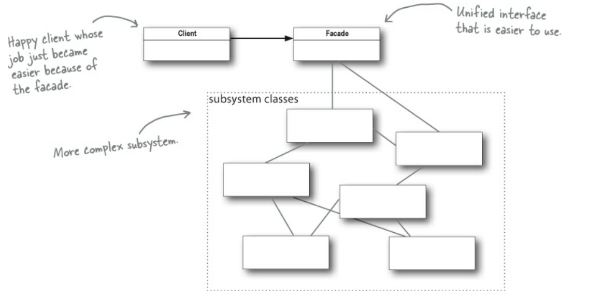
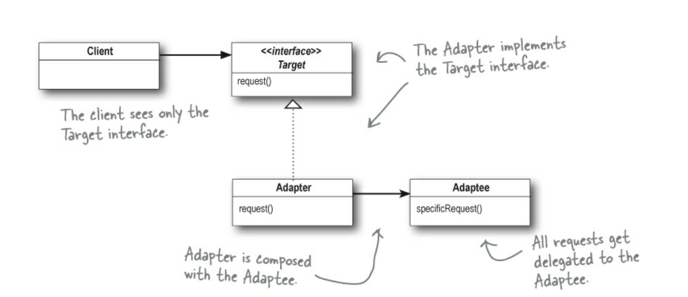
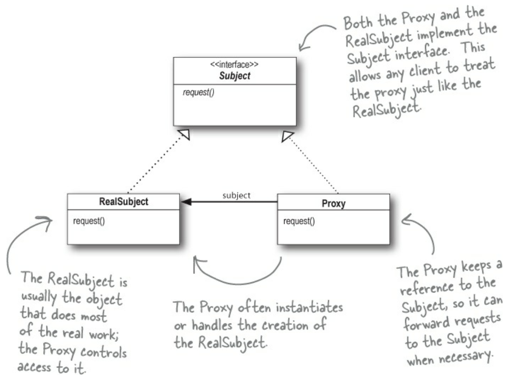
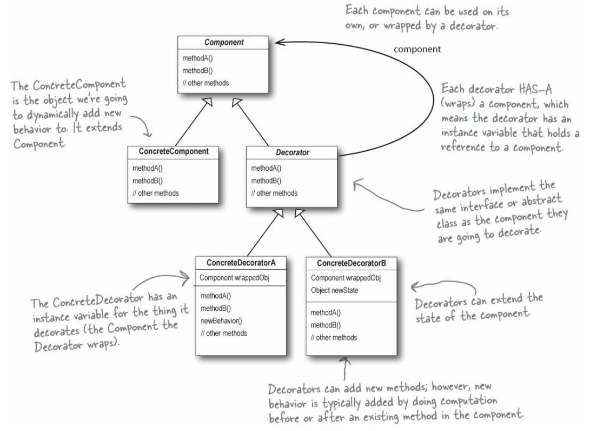
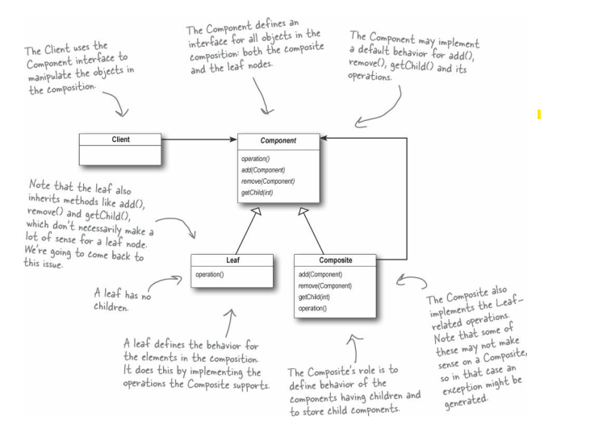
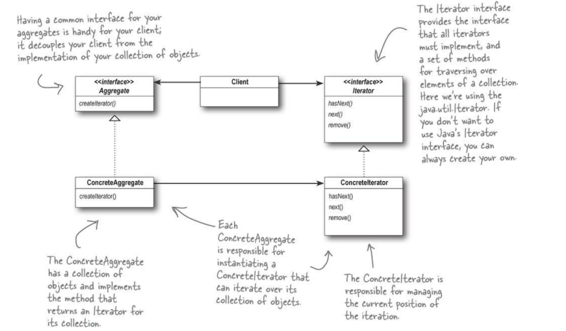

# Design Patterns
## Design Principles
* A class should have only one reason to change.

**POINTS TO BE CONCERNED**
* **Avoid encapsulation violation** - Do not make a class that directly access another class field. Also, the "client" class does not need to know how something is done or how something is inside an "service" class.
* **Bound code to concentrate classes** - Avoid implement something bound to the concrete version of classes. Prefer use interfaces to work with.

**TYPES OF DESIGN PATTERNS**
Generally speaking, there are three main categories of Design Patterns. They are:
  - **Creational Patterns**
  - **Structural Patterns** 
Use structural patterns to describe how different objects have a relationship (how they interact with each other). Also, how they should work to achieve a particular goal (how spicy and ingredients work to create a dish)
  - **Behavioral Patterns**
It defines how objects distribute work, how an object performs a single cohesive function and how different/independent objects work towards a common goal. (Race team trying to win the race).

## Creational Patterns
### Singleton

### Factory Method Pattern
The Factory Method Pattern **encapsulates object creation** by **letting subclasses decide what objects to create.**

**What is a factory?**
Generally, a factory is a method or an object that creates other objects.

Factories allow the client code operates on generalization. It is called coding to an interface.

**Benefits of Factory Objects**
If there are multiple clients that want to instantiate the same set of classes, then by using the Factory Method pattern we cut out the redundancy of code and made the code easier to modify (add more type of classes that can be instantiated).

**Factory Object vs Factory Method Pattern**
In factory method pattern, the creation of an object is separated in a different method. Instead of working with factory objects we specialize the class that uses the factory method.

**Creator Classes and Product Classes**
In the **creator classes** there is an abstract method that the **subclasses implement to produce Products**. 
(Often the creator class has code that depends on an abstract product which is produced by its subclasses).

**Summarisation**
By placing all my creation code in one object or method, It avoids duplication in the code and provide one place to perform maintenance. That also means clients depend only upon interfaces rather than the concrete classes required to instantiate objects. Moreover, this allows me to program to an interface, not an implementation, and that makes my code more flexible and extensible in the future.
# Todo - put the printscreen 

## Structural Patterns

### Facade Pattern

The facade pattern does not add new functionalities, but it acts as a point of entry into complex subsystems.

This is done by encapsulating the subsystem classes into a Facade class, and then hiding them from the client classes so that the clients do not know about the details of the subsystem.

**Facade Pattern Definitions**
- Is a means to **hide the complexity** of a subsystem by **encapsulating** it behind a unifying wrapper called a facade class
- Removes the need for client classes to manage a subsystem on their own, resulting in less coupling between the subsystem and the client classes
- Handles instantiation and redirection of tasks to the appropriate class within the subsystem
- acts as a point of entry and **does not add** more functionality to the system.

**What are the key design principles are used to implement the facade design pattern?**
Encapsulation, information hiding, separation of concerns

**Problem**

### Adapter Pattern 
The adapter essentially encapsulates a class X (adaptee) and presents a new interface, or appearance, to a client class that have to use functionalities from the adaptee class and cannot interect with that directly. It does this by wrapping the adaptee’s interface and exposing a new target interface that makes sense to the client. 

**So, if two interfaces are incompatible, why don't we just change one or even both, so that they are able to talk to each other?**
Imagine that the adaptee classes area thirdy-party libraries that we may not have access to, but if we did have access to those libraries an update in their code could break the existing code in other parts in our system that also iteracts with those libraries.

**Adapter Pattern Definitions**
- wrap the adaptee and expose a target interface to the client.
- indirectly change the adptee's interface into one that the client is expecting by implementing a target interface
- translate the client's requesto in to one that is expected by the adaptee
- reuse adaptee with other client's that have incompatible interfaces

**Problem**
There is a software system that one of its libraries must be replaced by a new one for security reasons, but the new library designed their interfaces differently than the last vendor and it is really hard to change the existing code (and the new library code cannot be changed).

**Solution**
In order to solve the problem, a class can be written to adapt the new library interface into one that the system are expecting.

### Proxy Pattern
The proxy pattern provides a place holder for another object to control access to it. The proxy pattern leverages the polymorphism so that the client class can expect the same interface for the proxy and the real subject class

**Proxy Pattern - Variations**
1. Remote Proxy - a remote proxy controls access to a remote object.
2. Virtual Proxy - A virtual proxy controls access to a resource that is expensive to create.
3. Protection Proxy - A protection proxy controls access to a resource based on access rights.

**How does the proxy pattern works?**
There is a Subject, which provides an interface for the RealSubject and the Proxy. By implementing the same interface, the Proxy can be substituted for the RealSubject anywhere it occurs.

The RealSubject is the object that does the real work. It’s the object that the Proxy represents and controls access to.

The Proxy holds a reference to the RealSubject. In some cases, the Proxy may be responsible for creating and destroying the RealSubject. Clients interact with the RealSubject through the Proxy.

**Problem**

**[Use Case] Virtual Proxy - CD Cover Implementation**
Consider a music application of music that holds several albums. Every time that an album is played its cd cover is displayed in the screen. The cover is retrieved from the server via internet. 

If the internet connection is slow while the cover is being downloaded an message will be stand in of the cover. This action will be performed by a virtual proxy. 

### Decorator Design Pattern
Add any number of behavior dynamically to an object at runtime by using **aggregation** as a substitute for pure inheritance. 

Polymorphism - It is achieved by implementing a single interface.
Aggregation - It lets create a stack of objects.

Each decorator object in the stack is aggregated in a one-to-one relationship with the object below it in the stack.

By combining aggregation and polymorphism, we can recursively invoke the same behavior down the stack and have the behavior executed upwards from the concrete componet object.

**Problem**

### Composite Design Pattern
**Goals**
* Compose nested structures of projects
* deal with the classes for these objects uniformly

The Composite Pattern allows you to compose objects into tree structures to represent part-whole hierarchies. Composite lets clients treat individual objects and compositions of objects uniformly.

The composite pattern can be understood as a tree structure with nodes that contain leaves that are the minor component of the tree or other nodes.

**WARNING!!**
All components must implement the Component interface; however, because leaves and nodes have different roles we can’t always define a default implementation for each method that makes sense. Sometimes the best you can do is throw a runtime exception.

**Problem**

Application needs to manipulate a hierarchical collection of "primitive" and "composite" objects. Processing of a primitive object is handled one way, and processing of a composite object is handled differently. **Having to query the "type" of each object before attempting to process it is not desirable**.

## Behavioral Patterns
It defines how objects distribute work, how an object performs a single cohesive function and how different/independent objects work towards a common goal. (Race team trying to win the race).

### Iterator Pattern
Provide a way to access the elements of an aggregate object sequentially without exposing its underlying representation.

** Delegating Responsibility**
The key idea is to take the responsibility for **access and traversal** out of the aggregate object and put it into an Iterator object that defines a standard traversal protocol.

**Removes the responsibility of traversing from the aggregate class and move it into an iterator**

#### See ListIterator Java - > it is an iterator that can go backwards

** Writing polymorphism code with Iterators **
It is possible to write “polymorphic code” using an iterator;
When methods are written and take Iterators as parameters, polymorphic iteration is being used. That means we are creating code that can iterate over any collection as long as it supports Iterator. We don’t care about how the collection is implemented, we can still write code to iterate over it.

**Problem**

### Template Method
The template method defines an algorithm's steps generally in the superclass, but lets subclasses overide specific steps of the algorithm without changing its structure. This pattern is concerned with the assignment of responsibilities.

**Problem **
There are several classes that have significant implementation similarities (some of then practically have the same implementation, although some lines of code are different, as it varies from implementation to implementation), but there is no resuse of common interface or implementation. If a change common to these classes becomes necessary, redundant effort must be expended.

### Chain of Responsibility
The Chain of Responsibility is a series of handler objects that are linked together. Each handler have methods that are written to handle specific requests.

When a client send a request, the first handler will try process it. If it can process so the flow ends, but if not the first handler will send the request onto the next handler in the chain. This pattern will continues until there is a handler to proccess or until the chain finish. 

This design pattern is intented to avoid coupling the sender to the receiver by giving morer than one object the chance to handler the requests. Whoever send the request does not need to care about who will process the request. It just need to send it to the first handler and hopefully someone in the chain will take care of the request.

**Problem**

### State Pattern
State design pattern allows an object change its behavior when something happens in its internal state making it change. So the State pattern is a solution to the problem of how to make behavior depend on state.

**When the State Pattern should be used?**
Change of behavior at run-time depending on the state of the application. Or or context (application context) is characterized by large and numerous case statements that drives the flow of control based on the current state.

**Problem**

### Mediator Pattern
The Mediator patttern defines an object that encapsulate how a set of objects interact with each other. The pattern restricts direct communications between objects and communications only take place via mediator. By applying this pattern, it is possible to obtain loose coupling and increase the variation of interaction among objects.

**Problem**

### Command Pattern
The command pattern working with requests that  are transformed into objects.

### TODO - Understand Strategy vs State Pattern
You’ve got a good eye! Yes, the class diagrams are essentially the same, but  
the two patterns differ in their intent.  
With the State Pattern, we have a set of behaviors encapsulated in state  
objects; at any time the context is delegating to one of those states. Over  
time, the current state changes across the set of state objects to reflect the  
internal state of the context, so the context’s behavior changes over time as  
well. The client usually knows very little, if anything, about the state objects.  
With Strategy, the client usually specifies the strategy object that the context  
is composed with. Now, while the pattern provides the flexibility to change  
the strategy object at runtime, often there is a strategy object that is most  
appropriate for a context object. For instance, in Chapter 1, some of our  
ducks were configured to fly with typical flying behavior (like mallard  
ducks), while others were configured with a fly behavior that kept them  
grounded (like rubber ducks and decoy ducks).  
In general, think of the Strategy Pattern as a flexible alternative to  
subclassing; if you use inheritance to define the behavior of a class, then  
you’re stuck with that behavior even if you need to change it. With Strategy  
you can change the behavior by composing with a different object.  
Think of the State Pattern as an alternative to putting lots of conditionals in  
your context; by encapsulating the behaviors within state objects, you can  
simply change the state object in context to change its behavior.

## References
[Java design patterns/](https://java-design-patterns.com/patterns/)

[OO Design](https://www.oodesign.com/)

[Refactoring Guru](https://refactoring.guru/)

[Source Making](https://sourcemaking.com/)

Freeman, Robson, Bates and Sierra, ed. Head First: Design Patterns.
 -
  - Structural Patterns - 
  - Behavioural Patterns
